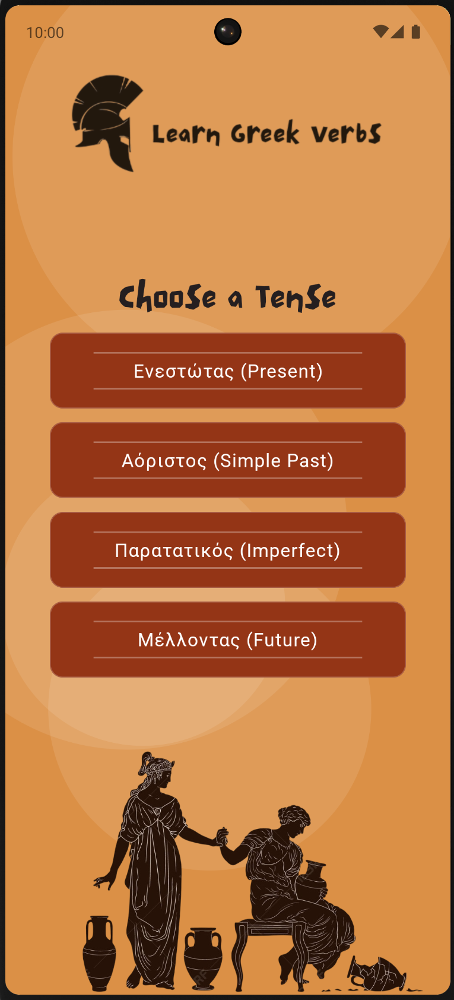
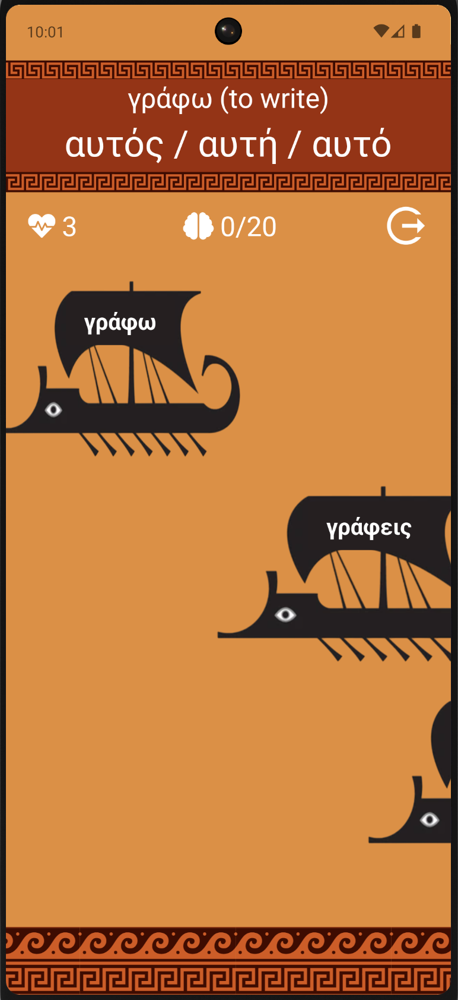
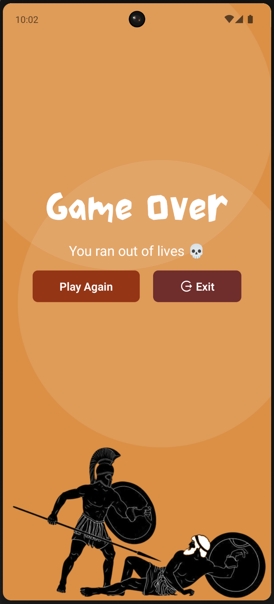

### 🇬🇷 Learn Greek Verbs

Learn Greek Verbs is a playful mobile application designed to help beginners practice Modern Greek verb conjugation. Whether you're just starting out or want a light and visual way to reinforce your knowledge, this app offers a simple and engaging way to drill Greek tenses and forms.

#### 🚀 How It Works

##### Choose a Tense

Currently, the game supports four tenses:

- Present
- Simple Past (Aorist)
- Imperfect
- Future

##### Pick a Verb

Each verb includes six conjugated forms, one for each personal pronoun.

##### Play the Game

You will be shown a random pronoun (like εγώ, εσύ, αυτοί, etc.). Your task is to find the correct verb form from several sails on the screen. Tap the right sail — if you miss, try again!

#### 🎮 Features

- Beginner-friendly vocabulary and grammar
- Visual, tap-based gameplay
- Four supported tenses (more to come!)
- Works offline, no internet connection required
- Built-in font support for consistent styling

#### 🛠️ Tech Stack

This project is built using Expo and React Native.

#### Key technologies and packages include:

- React 19
- React Native 0.79
- Expo ~53.0
- @react-navigation/native – for screen navigation
- expo-font – to load custom fonts
- expo-audio – for future sound features
- react-native-svg + svg-transformer – to display sail graphics
- react-native-responsive-screen – responsive layout helpers

#### 📦 Installation & Running Locally

```bash
git clone https://github.com/<your-username>/learn-greek-verbs.git
cd learn-greek-verbs
npm install
npm start
```

Then choose a platform in the Expo CLI:

```
Press a to open in Android emulator or device
Press w to open in browser
```

#### 📁 Project Structure

app.json – Expo configuration (UI style, splash, icons, permissions, etc.)
package.json – dependencies and scripts
assets/ – icons, splash screens, fonts
index.ts – entry point for the app

#### 📸 Screenshots

<p align="center">
  
  
  
</p>

#### 🙌 Contributing

Feedback, ideas, and pull requests are welcome. If you spot a bug or have a feature suggestion, feel free to open an issue.
